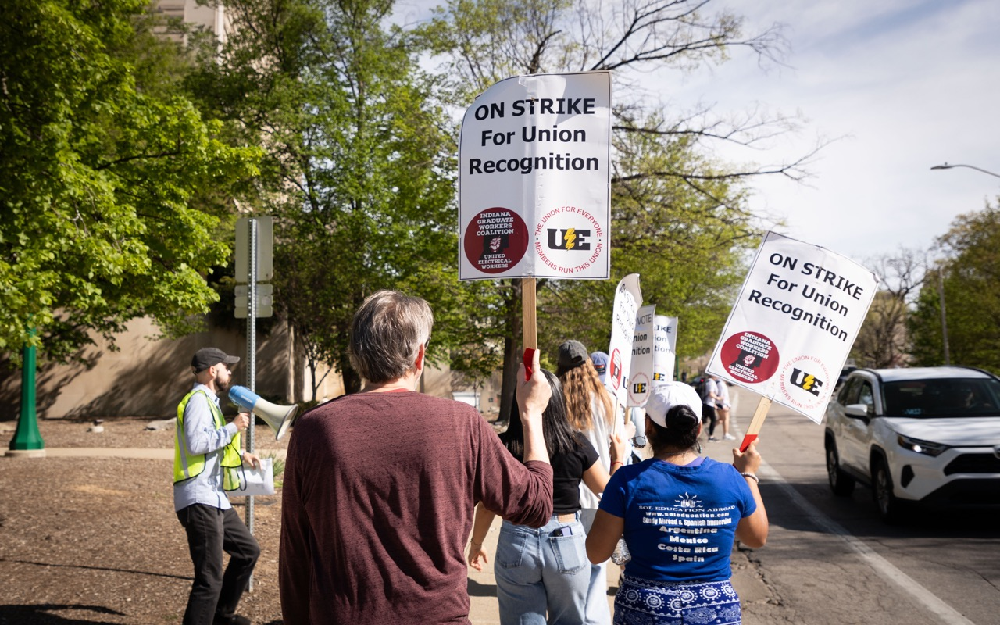

# Indiana Graduate Workers Coalition

Indiana Graduate Workers Coalition (IGWC) is a member-run labor union representing over 1,700 graduate workers and students at Indiana University, Bloomington.

Since 2019, we've fought for ([and won](/victories)) significantly better pay, better working conditions/benefits, and the end of exorbitant graduate student fees—all in a state without friendly labor laws. 

We're able to win in hostile conditions because of our commitment to **member-driven collective action**, and that means we need you!

<a href="organize">Join the union!</a>

# What Are We Fighting For?

In the face of attacks on higher education, IU must ensure adequately-funded work is protected for graduate workers with a reasonable timeline to graduation without placing additional burden on department budgets:

- **Guaranteed funding** through the end of our degree programs, including for graduate employees currently on NSF, NIH, NEH, FLAS, and other precarious federally-funded grants.
- **Financial security for all departments, programs, and cultural centers**, especially those that are made even more vulnerable by the ongoing attacks against DEI initiatives.  
- **An immediate raise** of 28% to $31k for minimum SAA stipends, to meet the standard set by the [recent raise given to President Pamela Whitten](https://www.idsnews.com/article/2025/02/pamela-whitten-reappointed-5-more-years-salary-raise), and a path toward universal 12-month contracts for SAAs with a living wage, which according to the MIT cost of living standard is $43k.

<a href="platform">See our full platform!</a>

# Join our Mailing List!

Want to stay in-the-loop with the IGWC at IU? Join our Mailing List! 

<a href="https://list.iu.edu/sympa/subscribe/igwc-ue-news-l">Join our Mailing List!</a>

