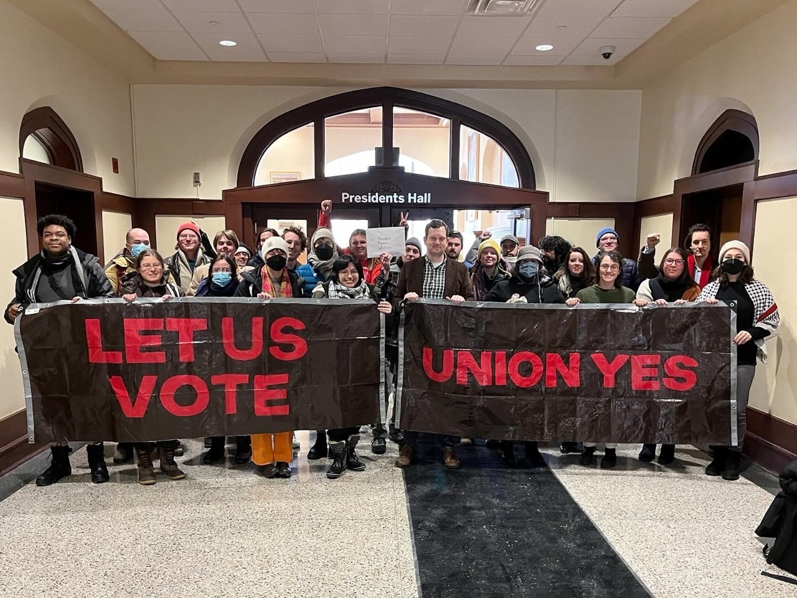
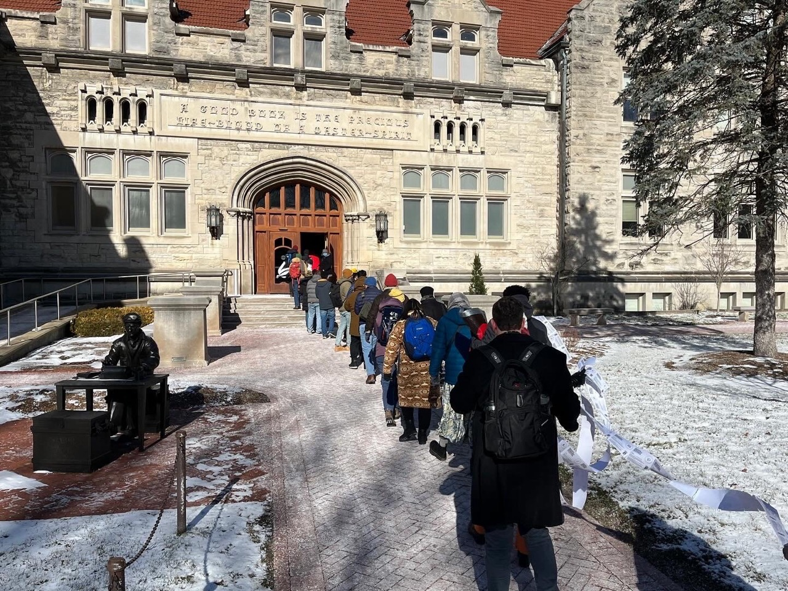

The Indiana Graduate Workers Coalition (IGWC) submitted a [formal union election demand](/archivevs/Recognition-Demand-Letter_Jan-2024-t6gl.pdf) to the Indiana University administration on Tuesday, January 16, 2024. At approximately 2:00 p.m., a group of IGWC representatives delivered a letter addressed to President Pamela Whitten that specifically asks the IU administration to pay its graduate workers, or Student Academic Appointees (SAAs), a living wage and to provide a pathway to union recognition. The letter asks President Whitten’s office to respond by January 29. 

The letter requests a pathway to unionization that would mirror the typical process established by the National Labor Relations Board. Graduate employees would vote to indicate their interest to be represented in collective bargaining, and IU would abide by this decision and negotiate a contract with an elected negotiating committee of graduate employees.

“There is nothing that restricts the administration from engaging in this simple exercise of democracy and guaranteeing a bargaining process should grad employees vote in favor of that,” said Sam Smucker, a PhD candidate in the Media School. “It is what Starbucks workers are able to do across the country almost every week. Certainly, IU should be more democratic than Starbucks.”

The demand for union recognition and a living wage reflects a majority of SAAs. Almost 1,300 signatories were included with the letter to the administration in support of the demands for a living wage and a union election. 

Current SAA contracts disburse a minimum of $22,000 to workers for 10-month contracts. IGWC asks the administration to pay SAAs a living wage, as prescribed by the MIT Living Wage Calculator, which amounts to a minimum of $27,973 for 10-month SAAs and $33,568 for 12-month SAAs. 

“When you’re a graduate worker, you’re often underpaid, overworked, and stuck in situations where people in authority over you have all the power,” said James Slaughter, a graduate student in Economics. “And if one of those people is exploiting you, the university unfortunately offers too little protection. But by coming together in a union, I have seen how we as graduate students can win incredible victories, like how we eliminated mandatory fees and have raised stipends repeatedly. When we join together, organize together, and fight back, we can protect ourselves and make this university a better place for all.”

The letter also cites the IGWC’s concern that the administration is refusing to practice shared governance. This policy guarantees that the administration will share decision-making authority with other governing bodies on campus. 

The Bloomington Faculty Council, the governing body for IU Bloomington faculty, voted back in April 2022 to endorse a pathway for the administration’s recognition of a graduate worker union. The final count tallied 1,404 in favor to 509 against. The administration has yet to act on the BFC’s resolution. 

During the strike in 2022, IGWC also received endorsements from the IU Graduate and Professional Student Government, Bloomington City Council, Monroe County Council, IU Student Government, the American Association of University Professors (AAUP), and hundreds of IU alumni. 
