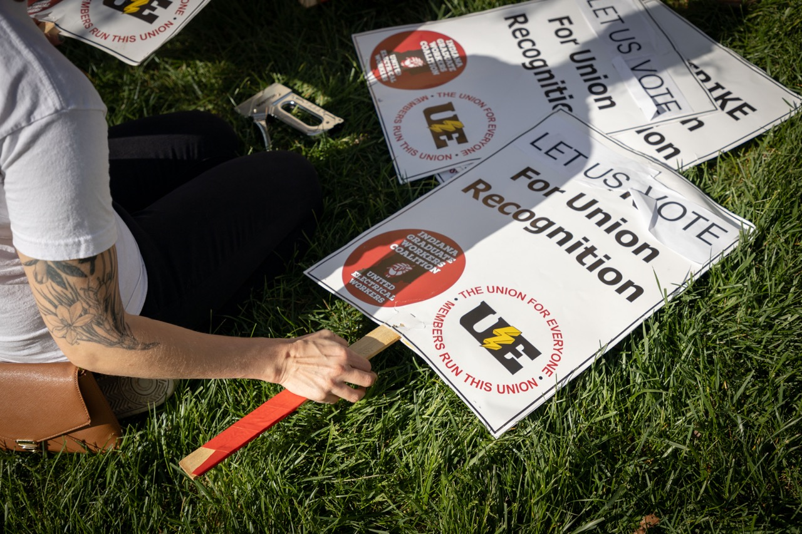

# About

<section>

IGWC is a member-run local—the General Assembly, comprised of all IGWC members, is the primary decision-making body in the union. 

The General Assembly delegates organizing tasks to the Organizing Committee, which meets weekly and oversees day-to-day organizing operations. The Organizing Committee is comprised of all Department Organizers and open to all members. The Organizing Committee nominates Area Coordinators to support organizing in various departments.

Those Area Coordinators make up the Coordinating Committee, alongside several officers elected directly by the General Assembly: the Co-chairs of the Coordinating Committee, the Financial Officer, the Communications Officer, and the Grievance Officer. 

</section>

<!-- Read more in our [By-Laws](/by-laws). -->

# Coordinating Committee

Dora Ahearn-Wood, Area Coordinator\
S. Dinesh, Area Coordinator\
Sam Duckworth, Area Coordinator\
S. Dutta, Area Coordinator\
Brian Hensley, Area Coordinator\
Ashton Hoene, Area Coordinator\
S. Kim, Area Coordinator\
Madeleine Meldrum, Area Coordinator\
A. Nambiar, Area Coordinator\
Ian Spink, Area Coordinator

[igwc@indianagrads.org](mailto:igwc@indianagrads.org)

Ann Campbell, Co-chair\
Adri Cruz, Co-chair\
[chairs@indianagrads.org](mailto:chairs@indianagrads.org)

Eli Beaton, Communications Officer\
[comms@indianagrads.org](mailto:comms@indianagrads.org)

Mike McCarthy, Financial Officer\
[finance@indianagrads.org](mailto:finance@indianagrads.org)

Madeleine Meldrum, Grievance Officer\
[grievance@indianagrads.org](mailto:grievance@indianagrads.org)

# Endorsements

The IGWC is proud to be endorsed across the IU campus—by faculty and staff members, departments, and undergraduate students—and by the broader local and state community.

## IU Campus Community

- [American Association of University Professors (AAUP) & Communications Workers of America (CWA)](/archives/Endorsement-from-AAUP-and-CWA.pdf)
- [Bloomington Faculty Council](https://twitter.com/IndianaGrads/status/1514000676879282189/photo/1)
- IU Alumni (1,200+ signatures & 980+ pledges to withhold donations)
- [IU Departments (25+ statements)](/non-retaliation-pledges)
- [IU Faculty Members & Staff (600+ signatures)](/faculty-neutrality-pledge)
- [IU Graduate & Professional Student Government](https://gpsg.indiana.edu/advocacy/Resolution%20PDFs/2021-22/Resolution%20in%20Support%20of%20Graduate%20Worker%20Unionization.docx.pdf)
- [IU Student Government](/archives/IUSG-endorsement.pdf)
- [IU Student Government—Sustainability Committee](https://www.instagram.com/p/CcVrbQSuKkN/)
- [IU Undergraduate Students & Parents (1,000+ signatures & many more emails sent)](https://www.change.org/p/iub-undergraduate-students-community-members-for-graduate-workers-union?changeinvitetoteam=true)
- [IU College Democrats](https://twitter.com/DemocratsAtIU/status/1513622813617315847)
- [IU Native American Student Association](https://www.instagram.com/p/CciT9gKuJmS/)
- [IU Pakistani Student Association](https://www.instagram.com/p/CcTQlBLJJHK/)
- [IU Queer Student Union](https://www.instagram.com/p/CcQ6pROp4eJ/)
<!-- - [IU Residence Hall Association](https://twitter.com/RHAatIU/status/1514236619930415105) -->

## Political Leadership

- [State Senator Shelli Yoder & State Representative Matt Pierce](/archives/yoder-pierce-endorsement.jpg)
- [Bloomington City Council](https://bloomington.in.gov/onboard/legislationFiles/download?legislationFile_id=5690)
- [Monroe County Council](https://www.co.monroe.in.us/egov/documents/1652289734_60376.pdf)
- [Bloomington DSA](https://bloomingtondsa.org/pdfs/DSA-IGWC-Endorsement.pdf)
- [Democratic Women's Caucus](/archives/democratic-womens-caucus.jpeg)
- [Hoosier Action](https://twitter.com/HoosierAction/status/1513657032901074944)
- [Indiana Latino Democratic Caucus](/archives/Endorsement-from-LDC.png)
- [Monroe County National Organization for Women](https://twitter.com/MonroeCountyNOW/status/1513974227543670787)
- [Monroe County Democratic Party](/archives/monroe-county-dems-endorsement.pdf)

## Labor Leadership

- [Southern Indiana Area Labor Federation, AFL-CIO](/archives/AFL-CIO-endorsement.pdf)
- [AFSCME Local #613](/archives/AFSCME-Local-613-endorsement.pdf) (Bloomington Transit Employees)
- [AFSCME Local #2802](/archives/AFSCME-Local-2802-endorsement.jpeg) (Monroe County Public Library Workers)
- [ARA—Officers of the Indiana Alliance for Retired Americans](/archives/alliance-for-retired-americans-endorsement.pdf)
- [BCTGM Local #372-A—Indianapolis](/archives/BCTGM-Local-372-A-endorsement.jpeg)
- [International Alliance of Theatrical Stage Employees (IATSE)](/archives/IATSE-endorsement.pdf)
- [Monroe County Education Association](https://twitter.com/MCEABloomington/status/1513653008906792970)

## Professional Organizations

- [The American Academy of Religion](/archives/AAR-endorsement.jpeg)
- [The American Folklore Society](https://americanfolkloresociety.org/afs-supports-grad-student-workers-rights/)
- [The American Historical Association](https://www.historians.org/jobs-and-professional-development/statements-standards-and-guidelines-of-the-discipline/statement-on-right-to-engage-in-collective-bargaining)
- [The Modern Language Association of America](https://www.mla.org/Resources/Advocacy/Executive-Council-Actions/2022/MLA-Statement-in-Support-of-the-Indiana-Graduate-Workers-Coalition)
- [Organization of American Historians](https://www.oah.org/site/assets/files/14576/statement_on_graduate_student_organizing_april_2022.pdf)
- [The Society for Ethnomusicology](https://www.ethnomusicology.org/news/603887/Graduate-Student-Organizing-and-Compensation.htm)
- [The Society for Music Theory](https://twitter.com/SMT_musictheory/status/1521518471930163201)
- [Working Class Studies Association](/archives/WCSA-endorsement.pdf)

## Other Graduate Worker Organizations

- [AAUP-AFT Local 6075—Wayne State University](https://twitter.com/aaupaft6075/status/1514385327128985604?s=21&t=7NPSrYsDsy0mofD8bVjq4Q)
- [AAUP—University of Pennsylvania](https://twitter.com/aaup_penn/status/1514228348502921218?s=21&t=91ZUAhOMF8KsAU-4D5-5Xw)
- [CUGWU-Teamsters—Clark University](https://twitter.com/CUGWU_Teamsters/status/1514282113297702923)
- [Graduate Students United—University of Chicago](https://twitter.com/uchicagogsu/status/1514624591913795586)
- [WashU Undergraduate & Graduate Workers Union—Washington University in St. Louis](https://wugwu.org/)
- [Fearless Student Employees—University of Maryland, College Park](https://twitter.com/FSE_UMD)
- [FGSW-CWA—Fordham University](https://fordhamgraduatestudentworkers.com/)
- [GEO at UIUC—University of Illinois, Urbana-Champaign](https://twitter.com/geo_uiuc/status/1511810407232589833?s=21&t=x-EM19uO_-ND3MRR1FNGfQ)
- [Graduate Employees' Organization, AFT Local 3550—University of Michigan](http://www.geo3550.org/member/)
- [Graduate Labor Organization—Brown University](https://twitter.com/gradlabororg/status/1514600767788789765?s=21&t=rlgKXmM5IAY64ejxt9B6kA)
- [GSOC NYU—New York University](https://www.instagram.com/p/CcgMWWzgzaq/)
- [Harvard Graduate Student Union, UAW Local 5118—Harvard University](https://www.instagram.com/p/CcTH5xuuXwH/?hl=en)
- [Kenyon Student Worker Organizing Committee (K-SWOC/UE)—Kenyon College](https://twitter.com/kswoc/status/1516286446860070914?s=20&t=8stigb03CD8pE6iEjfEShA)
- [Marquette Academic Workers Union—Marquette University](https://mawulocal.org/)
- [MIT GSU-UE—Massachusetts Institute of Technology](https://mitgsu.org/)
- [Student Workers of Columbia—UAW Local 2710—Columbia University](https://www.studentworkersofcolumbia.com/)
- [UIC Graduate Employees Organization—University of Illinois Chicago](https://uic-geo.net/mainsite/)
- [Union of Graduate Student Workers (UGSW)—University of New Brunswick](https://twitter.com/UGSW/status/1513254658420092929?cxt=HHwWgsCtnYTGlIAqAAAA)
- [United Graduate Workers of UNM (UGW-UE 1466)—University of New Mexico](https://twitter.com/unmgradworkers/status/1516505168740687877?s=21&t=Ncs7NBOE6y8_0huf2uFShA)
- [Vanderbilt Graduate Worker's Union—Vanderbilt University](https://twitter.com/VandyGradUnion/status/1514327454642368515)

