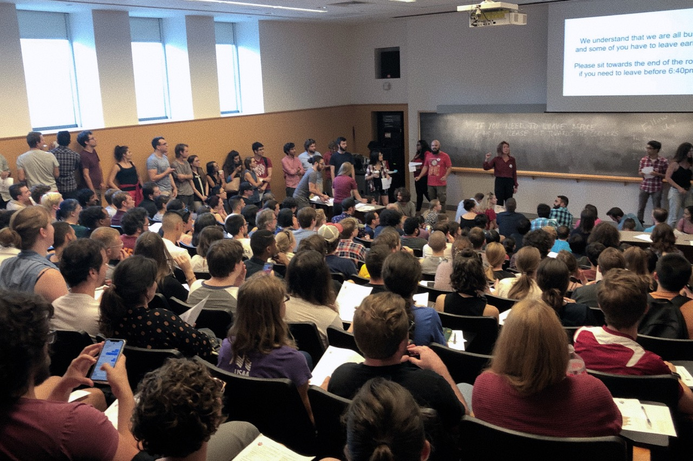
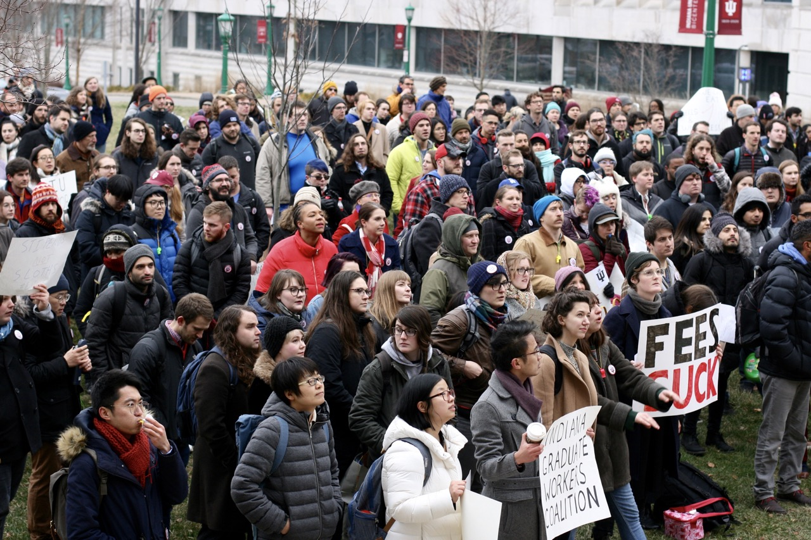
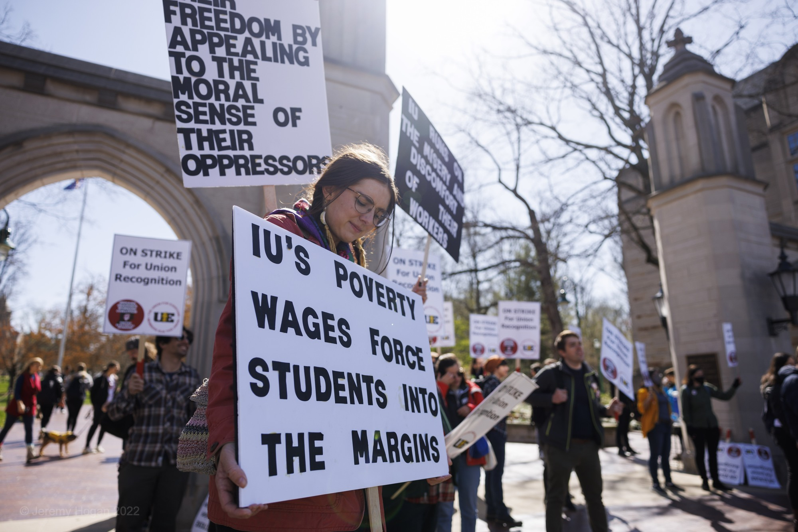
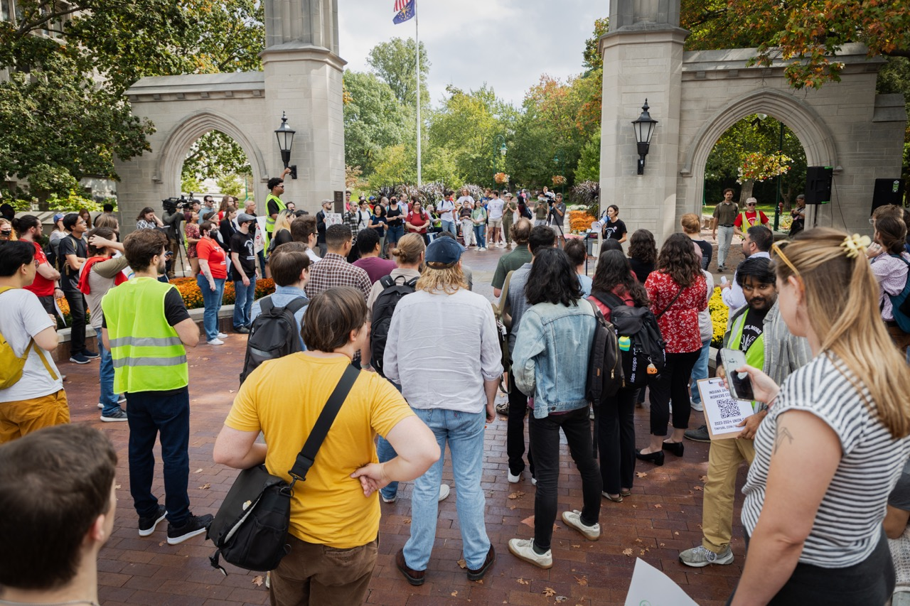
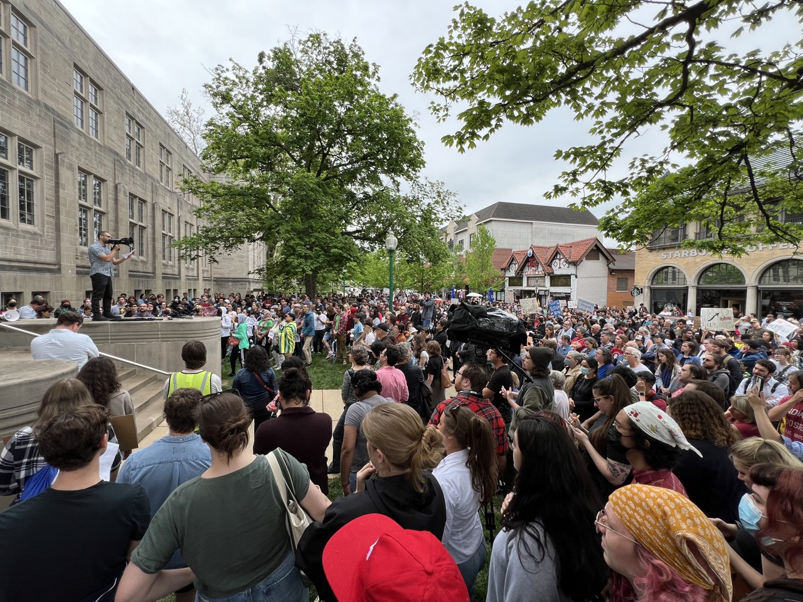
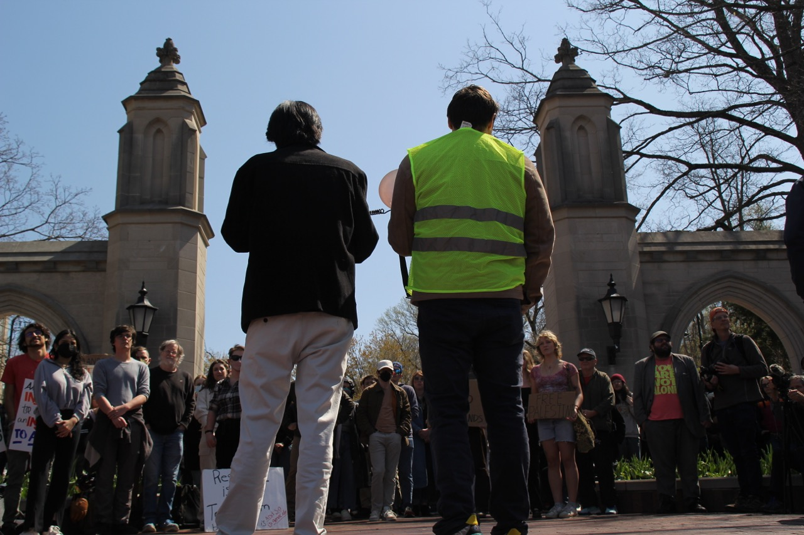

import {PhotoGrid} from '/src/layouts/components/carousel'

# History

In 2019, a small group of graduate students began having one-on-one meetings in departments. The minimum stipend for graduate workers in 2019 was less than $15K a year. More pressing than the abysmal wages, though, were the mandatory student fees totalling $1,435 paid *back* to the university. Between the low wages and the mandatory fees, graduate workers at IU were less $1,200 above the [poverty line in 2019](https://aspe.hhs.gov/topics/poverty-economic-mobility/poverty-guidelines/prior-hhs-poverty-guidelines-federal-register-references/2019-poverty-guidelines). International students were forced to pay even more in fees—over $3000 a year. 

<section>

## 2019 Townhall and Petition 

In Fall 2019, we launched our end-the-fees campaign with a town hall attended by over 200 graduate workers. At that town hall, we began a petition to demand the end of the fees. By December, the petition had over 2,000 signatures. 

</section>

## 2020 Fee March

In January 2020, over 500 graduate workers marched to deliver the petition to the Vice Provost and engage in bargaining about the fees. The Vice Provost agreed to a follow-up meeting but did not respond to future requests. 

After the Fee March, we hosted several large meetings before the pandemic interrupted our organizing for the semester. 

<section>

## 2021 Fee Strike

In Spring 2021, now organizing as the Indiana Graduate Workers Coalition (IGWC), we launched a fee strike. Over 800 graduate workers commit to withhold fees. IU administration illegally threatened to retaliate against international students.

At the end of the Fee Strike, we voted to endorse unionization as the only solution to graduate employee issues. United Electrical Workers (UE) agreed to support our union drive and IGWC becomes IGWC-UE.

That summer, the IGWC-UE gathered union cards from graduate employees. In December, we deliver 1,600 signed union cards—a supermajority of graduate workers in Bloomington—demanding a union election. 

</section>

## 2022 Strike

In February 2022, the IU Administration rejected our request for a union election. After multiple meetings with members, we launched a strike pledge drive and formalized a department organizer system with 100 union representatives holding town halls, strike trainings, and getting members to sign strike pledges. 

In March, Union members delivered letters two times per week to the Provost asking for a meeting. The Provost never answered our letters. At a "Listening Session," dozens of union members overwhelmed Provost Shrivastav and the Vice Provost with demands for union recognition.

In an attempt to avoid the strike, IU administration raised the minimum stipend from 15k to 18k days before the first strike vote, but refused to meet with IGWC representatives or end the fees. 

IGWC members authorized the strike, with 97.8% in favor. 

<PhotoGrid client:load images={[
'/src/media/2022-04-26-strike-imupicket2.jpeg',
'/src/media/2022-04-15-strike-ballantine.jpeg',
'/src/media/2022-04-15-strike-jacobs.jpeg',
'/src/media/2022-04-19-strike-dance.jpeg',
'/src/media/2022-04-23-strike-flying-picket.jpeg',
'/src/media/2022-04-29-strike-march.jpeg',
'/src/media/2022-04-21-strike-dgsmeeting.jpeg',
]}/>

The strike began April 13, 2022. After a [tornado warning](https://www.idsnews.com/article/2022/04/graduate-workers-postpone-first-day-of-picketing-due-to-severe-weather) forced us to postpone the first day of picketing, over 1000 graduate workers picketed at three key locations across campus. The strike continued strong over the next four weeks, with over 95% reauthorization every week. Every student at IU had at least one struck class, and the total struck work totaled well over 80,000 labor hours.

In May during the strike, over 700 faculty members responded to our strike with the first Special Meeting of Bloomington Faculty in 17 years. They overwhelmingly votes to take back the power to appoint graduate workers from the Provost. The faculty also overwhelmingly endorsed a pathway for unionization for IGWC-UE. IGWC-UE members chose to suspend the strike until September 26, 2022.

In the lead up to our second strike vote, the IU Administration made massive concessions, including the [elimination of all graduate student fees, improved healthcare, and a new minimum stipend of $22k for all graduate workers](/victories)—a 46% increase from before the strike was announced. This raise was the largest pay increase on Bloomington's campus in over a decade for any unit besides upper administration. 

Following these concessions, our leadership recommended a "No" vote on the September 2022 strike, and union members vote not to continue the strike.

## 2023

<section>

In January 2023, with inflation at a record high, IGWC-UE launched a Cost of Living Adjustment Petition, calling for 8% raises, commensurate with inflation, garnering over 1,000 signatures over the course of the semester.

In March 2023, IGWC-UE delivered the Cost of Living Adjustment Petition with to the IU Administration. During a Bloomington Faculty Council (BFC) meeting, Provost Shrivastav rejects the petition as "too expensive." After public demonstrations against the Provost and buzz about another strike push, IU Administration were forced to announce a 3% wage increase for all returning graduate workers in July—the first all-department cost-of-living wage increase in over a decade.

In Fall 2023, we launched another union campaign, collecting over 1,300 union cards from graduate employees to demand union recognition and a living wage.

</section>

## Spring 2024

In January, the IGWC made its demand for a union election and a living wage from the IU Administration, requesting a meeting to begin a bargaining relationship with the university.

After receiving no communication from the university, on February 5, 2024, the IGWC passed a vote of no confidence in IU President Pamela Whitten’s Administration as a result of their failure to respond to the IGWC's demands for a union election and a living wage. The vote of no confidence also cites the [suspension of Professor Abdulkader Sinno](https://www.idsnews.com/article/2024/01/faculty-iu-violated-university-policy-abdulkader-sino-suspension) and the [cancellation of IU alumna Samia Halaby’s exhibition](https://www.npr.org/2024/02/17/1232243208/indiana-university-abruptly-canceled-a-palestinian-artists-exhibit-its-now-sold-) as evidence that the Whitten administration is suppressing fundamental rights on campus. 

In the following weeks, [IU Bloomington graduate organizations and GPSG](/no-confidence-votes-2024) joined IGWC in passing their own votes of no confidence in Whitten’s Administration.

## 2024 Strike

After over 500 one-on-one conversations with union members, the IGWC Organizing Committee endorses a strike pledge for a "Three Days For A Raise" Strike, Wednesday through Friday, April 17-19.

After collecting 800 strike pledges, 500 of which were from graduate workers with instructional positions, the IGWC endorsed a call for a three day strike. At the April 14 General Membership Meeting, members endorsed voting YES to strike for three days, April 17-19, launching a 24-hour strike authorization vote for all 1,300 union members to vote. Union members voted 92% in favor of a strike, officially striking "Three Days for a Raise" on April 17-19.

<PhotoGrid client:load images={[
'/src/media/2024-04-17-strike-group.jpeg',
'/src/media/2024-04-17-strike-march2.jpeg',
'/src/media/2024-04-17-strike-picket.jpeg',
'/src/media/2024-04-17-strike-banner.jpeg',
]}/>

On April 16, 2024, the day before the first day of the IGWC three day strike, the IU Bloomington faculty [overwhelmingly passed votes of no confidence for IU President Pamela Whitten, Provost Rahul Shrivastav, and Vice Provost for Faculty and Academic Affairs Carrie Docherty](https://www.idsnews.com/article/2024/04/whitten-rebuked-iu-faculty-vote-no-confidence-in-whitten-shrivastav-docherty). Of 895 ballots, 672 (75%) expressed No Confidence in Docherty; of 879 ballots, 804 (91.5%) expressed No Confidence in Shrivastav; and of 888 ballots, 827 (93.1%) expressed No Confidence in Whitten.

<section>

Shortly after our strike, the Palestinian Solidarity movement on campus established an encampment in Dunn Meadow. In response, President Whitten authorized the violent removal of the peaceful encampment. Indiana State Police in riot gear assaulted, arrested, and banned 33 IU students and faculty from campus, including several IGWC members and organizers. During the raid, the President also directly approved the use of a [Indiana State Police sniper on the roof of the Indiana Memorial Union](https://archive.org/details/indiana-university-palestinian-solidarity-encampment-police-scanner-archive). 

In response to the brutal police response on Dunn Meadow, the IGWC called for the resignation of IU President and Provost. Over 500 IU community members ranging from graduate workers to students to faculty and staff joined the protest in one of the largest demonstrations in Bloomington since the 2022 strike. 

</section>

## 2025 Anti-Visa Revocation

<section>

Over the next year, IGWC focused on building our membership and organizing capacity, but in April 2025, the Trump administration cancelled the SEVIS record for multiple students at IU, including several IU graduate workers and IGWC members. In response to that attack on our members, we mobilized an emergency action with a pathway to a strike. In a negotiation with IU administration, IGWC secured continued student status and a pathway to degree for those unjustly impacted by the DHS, as well as several other concessions to protect international workers.
 

</section>

--------

We're not finished fighting for workers at IU. See what we're building now:

<a href="/organize">Organize!</a>

