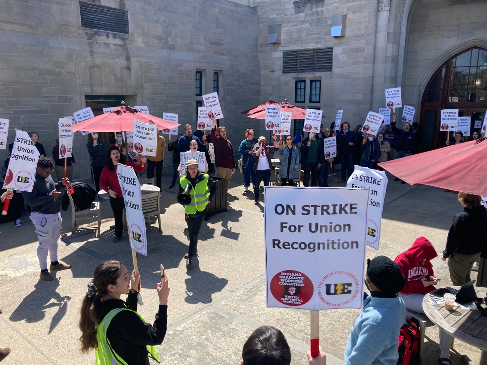

# Organize with us!

<section>

We’re able to win in hostile conditions because of our commitment to member-driven collective action, and that means we need you!

- Sign a [union card](/card)
- Come to an [Organizing Committee meeting](/calendar)
- Get in touch with your DO and help [organize your department](/meet-with-me)
- Sign up for [Voluntary Dues](/dues)

Just want more information? [Schedule a meeting with an organizer!](/meet-with-me)

</section>
