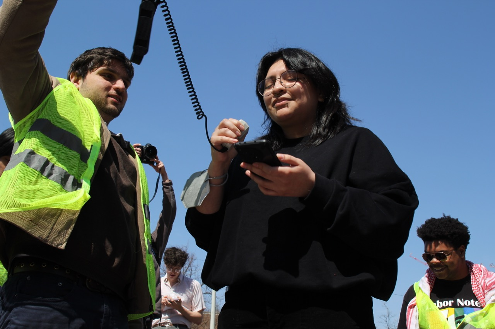

# Platform

<!--  -->

<section>

## A Living Wage

- First and foremost, graduate workers require a living wage and universal 12-month contracts with yearly cost-of-living adjustments. The [MIT Living Wage Calculator](https://livingwage.mit.edu/counties/18105) defines a living wage for Bloomington as $43,605. Currently, graduate workers at IU make only a minimum stipend of $24,000. 

## Collective Bargaining 

- We also demand that IU recognize the IGWC as the collective bargaining representative for graduate workers at IU. In order to consistently secure our demands, we need a seat at the bargaining table.

## Fair Work & Degree Expectations

- We call for more appropriate and consistent limits on SAA workload across units, consistent and clear degree requirements across graduate programs, expanded SAA input on department curricula, and a commitment to making graduate work accessible for all.

## Fairness for International Students

- We call on IU to ensure that international graduate workers are treated with dignity, that work and academic opportunities are distributed equitably, and that international students have access to the resources they need to deal with issues related to visa status.

## Expanded Medical & Parental Benefits

- We call for a more thorough and publicized paid medical leave policy, guaranteed parental leave, affordable dependent medical coverage, subsidized child care, expanded coverage for surgical and mental care, and protections for reproductive rights.

## Protect Higher Education

- We call for continued investment in graduate funding from the administration so that necessary improvements in our working conditions are sustainable and do not come at the expense of departments, especially smaller programs and marginalized graduate workers.

</section>
