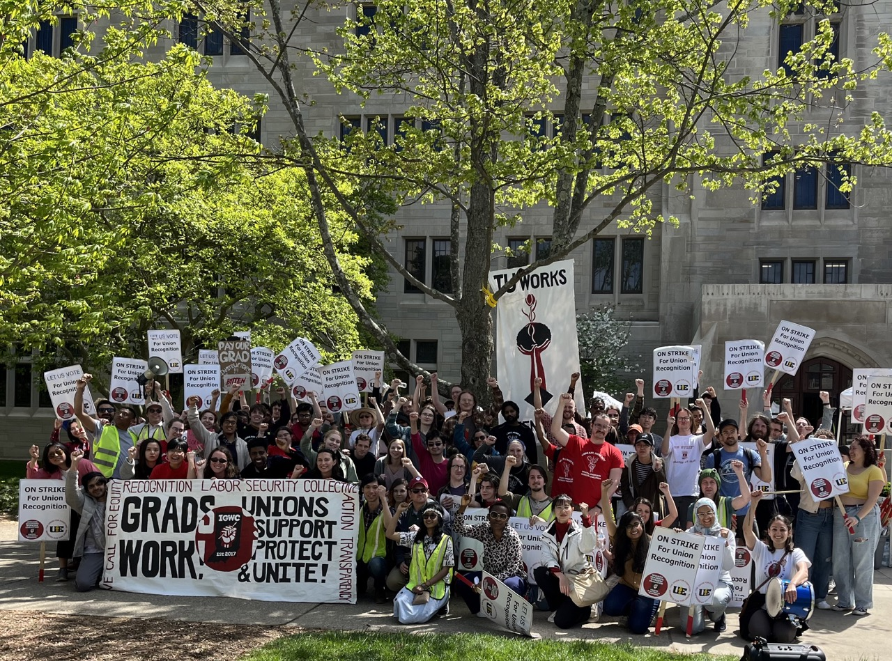

# Victories

We've already won significant material gains for graduate workers through our organizing and collective action, including [marches](history#2020-fee-march), protests, petitions, and two massive strikes: the [2022 Graduate Worker Strike](history#2022-strike), and the [2024 "Three Days For A Raise" Strike](history#2024-strike).

## We won wage increases!

- **August 2022:** After almost 10 years of stagnant wages, [IU raised the minimum SAA stipends](https://news.iu.edu/live/news/28008-iu-bloomington-increases-minimum-stipends-waives) to $22,000, a **46% increase** over the minimum SAA stipend of $15,000 in Fall 2021. Some departments were previously paid as little as $7,000 a year. IU also committed to ensure “minimum stipends and discipline-specific stipend rates remain in the top half of the Big Ten” going forward, with a mandatory review process for SAA stipends to be conducted every two years.
- **July 2023:** [IU gave a 3% raise](https://www.indianagradworkers.org/s/Deans-Memo_3-raises_July-2023.png) ($660 a year) to returning SAAs for the 2023–2024 academic year. 
- **January 2025:** [IU announces a 4% raise](https://news.iu.edu/live/news/43363-iu-bloomington-increases-minimum-stipends-expands) ($1,000 a year) for all graduate workers after protracted meetings following the 2024 Strike. 

## We ensured international student's status!

- **April 2025:** When the Trump administration revoked visas status for several graduate workers, [we launched a protest and negotiation](https://igwc.work/email/2025-04-10.html) that forced IU to ensure a flexible pathway to degree for anyone impacted, active monitoring of the SEVIS database, and non-cooperation with the Department of Homeland Security without a warrant. 

## We eliminated fees, including international student fees!

- **August 2022:** [IU waived the mandatory graduate student fees](https://news.iu.edu/live/news/28008-iu-bloomington-increases-minimum-stipends-waives) of $1,435 paid by all SAAs as well as some course-specific fees for SAAs in programs that charge them. 
- **September 2022:** [IU waived the international student fee](https://provost.indiana.edu/resources/grad-resources/archive/sept-13.html) and the G901 fee for SAAs.

## We won healthcare and other benefits!

- **October 2022:** [IU changed its Leaves of Absence policy](https://provost.indiana.edu/resources/grad-resources/task-force.html) to provide full insurance benefits to SAAs on medical or parental leave, including unpaid leaves, for up to six months.
- **May 2023:** [IU restored the SAA Affairs Committee on the Bloomington Faculty Council](https://bfc.indiana.edu/policies/saa-grievances.html) (BFC), and the BFC passed a new policy for the SAA Board of Review, which reviews graduate student grievances and complaints related to the terms and conditions of their academic appointments. 
